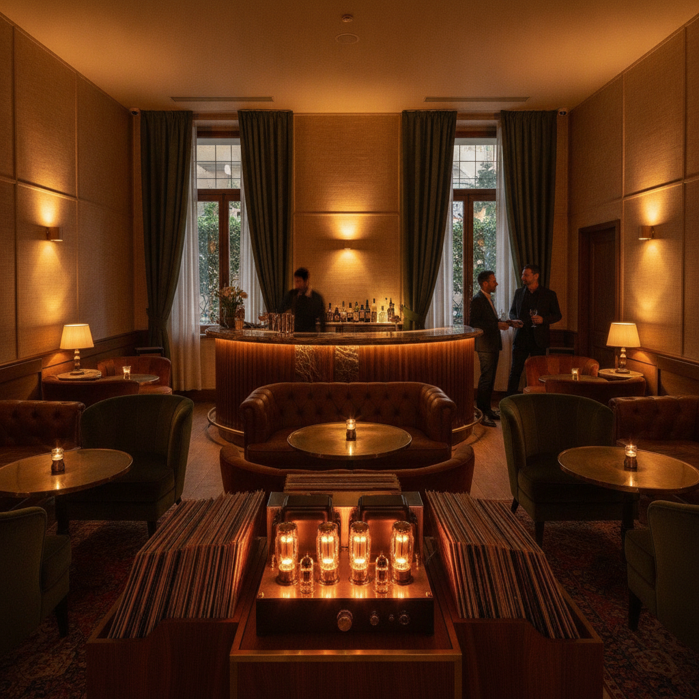

# A Quiet — Brand Style Guide & Location Scouting Blueprint (2026)

This document establishes the official visual, verbal, and spatial brand system for **A Quiet**. It ensures absolute consistency across our digital portal, physical print materials, and—most critically—guides the scouting and selection of our physical sanctuary in Tel Aviv.

---

## 1. Visual Brand Atmosphere

---

## 2. Color Palette (The Glow Nocturne System)

Our color system is built around the raw warmth of mid-century analog design, physical paper stocks, and the organic amber light of glowing vacuum tubes.

| Design Name | Hex Code | CMYK (Print-Ready) | Brand Application & Strategic Role | Architectural & Physical Material Counterpart |
| :--- | :--- | :--- | :--- | :--- |
| **Aged Parchment** | `#F5F2E9` | C4 M3 Y9 K0 | Primary Background. Digital canvas backdrop, printed menus, stationery, and vintage linen record sleeves. | Raw unpainted plaster, limestone, textured linen wall coverings, unbleached heavy cardstock. |
| **Deep Walnut** | `#3C2F2F` | C62 M70 Y66 K68 | Primary Typography & Contrast. Core layout grids, brand titles, and permanent branding marks. | Custom hand-oiled solid American Walnut cabinetry, dark-stained oak flooring, structural framing. |
| **Tube Glow Orange** | `#FF8C00` | C0 M55 Y100 K0 | Secondary Accent. Interactive states, map pulses, digital highlight states, and localized visual focus. | 2200K low-voltage filaments, custom neon accents, amber indicators of the Leben CS-600X. |
| **Nocturnal Black** | `#1A1A1A` | C75 M68 Y67 K90 | UI Dark Sections & Contrast. Digital underlays, vinyl record catalog interfaces, and nocturnal backdrops. | 180g virgin vinyl pressings, raw powder-coated structural steel, matte-black hardware. |
| **Forest Velvet** | `#2D3E33` | C71 M44 Y65 K39 | Secondary Material Palette. Digital background accents and physical comfort signifiers. | Heavyweight (600g/sqm) acoustic drapes, velvet-upholstered lounge chairs, panel coverings. |

---

## 3. Typographic Hierarchy

Our typeface choices combine the classical intellectual depth of mid-century jazz labels with the clean, structured utility required by a modern Tel Aviv audience.

### Primary Display Typeface: **Playfair Display** (Serif)
*   **Aesthetic Vibe**: Classic, authoritative, literary, tactile.
*   **Usage**: Brand headlines, editorial quotes, section headers, pricing tier numbers, and primary navigation highlights.
*   **Usage Rules**: Always maintain generous letter-spacing on uppercase displays, or tight, elegant tracking on lowercase quote sentences. Never use for long-form body copy.

### Secondary Body Typeface: **Source Sans 3** (Sans-Serif)
*   **Aesthetic Vibe**: Contemporary, clean, highly readable, precise.
*   **Usage**: Long-form body text, record metadata, tabular datasets, pricing cards, buttons, input fields, and technical labels.
*   **Usage Rules**: Use Light (300) weight for long-form descriptions to preserve "quiet space" on the page, and Semi-Bold (600) for interactive states or metadata headings.

---

## 4. Verbal Identity & Copywriting Tone

To defend our sub-85dB sanctuary promise, all verbal communication must adhere to these foundational principles:

*   **Rule 1: Cultivate Stillness** — Avoid high-energy, hyper-promotional exclamation marks, or aggressive "FOMO" sales copy. Speak with the calm, relaxed confidence of an expert selector.
*   **Rule 2: Emphasize the Analog Ritual** — Focus on tactile, sensory details (e.g., "the physical weight of a 180-gram pressing," "the organic warmth of a glowing vacuum tube," "the smell of hand-oiled American Walnut boards").
*   **Rule 3: Neighborhood Integration** — Frame our presence as a respectful, low-impact cultural addition to Lev HaIr. We are not a nightlife disruptor; we are a quiet community parlor.

---

## 5. Physical Location Scouting Blueprint (Tel Aviv)

Our brand identity is intrinsically tied to physical materials and acoustic physics. To find a location in Tel Aviv that matches the **Glow Nocturne** brand standards and fits the business model, we must use the following checklist and parameters:

### A. Location Filters & Target Neighborhoods
1.  **Lev HaIr (Preferred Side Streets)**: Side-streets like **Mazeh St. or Nachmani St.** over main avenues like Rothschild Blvd. Side-streets protect our dim, unhurried interior mood from the harsh central Tel Aviv glare and reinforce the "hidden sanctuary" feeling.
2.  **Montefiore District (The Industrial Shell alternative)**: High industrial ceilings provide exceptional acoustic dispersion. Industrial concrete slabs reduce vertical vibration leakage.
3.  **Neve Tzedek / Shabazi (The Luxury alternative)**: Thick 19th-century masonry walls provide natural high-mass isolation, requiring 40% less soundproofing build-out compared to hollow-ribbed Bauhaus structures.

### B. Structural & Brand Match Checklist
*   **Minimum Clear Height**: **3.5 meters** is non-negotiable. Lower heights cramp the custom floor-to-ceiling walnut cabinetry and degrade the spatial acoustic dispersion of the Klipsch Cornwall IV speakers.
*   **Structure Column Density**: Avoid units with hollow-ribbed concrete ceilings or shared lightweight drywall partitions. Mass-heavy concrete slabs or historic solid stone are required to maintain <40dB noise compliance with upstairs neighbors after 11:00 PM.
*   **Storefront Exposure**: Prefer north-facing, shaded, or set-back entrances. Avoid massive west-facing glass frontage unless heavy Forest Velvet acoustic drapes are budgeted to prevent ambient thermal gain and high-frequency flutter reflections.

### C. Site Scoring Formula
When scoring potential shells in Tel Aviv, apply the following weights:
*   **Acoustic Potential (35%)**: Isolation baseline of ceilings/columns, basement availability, and neighboring layouts.
*   **Regulatory Ease (25%)**: Cafe-Bar (Category 4.2.a) eligibility, active license transfer speed, and exit clause viability.
*   **Foot Traffic Alignment (20%)**: High concentration of design-conscious professionals, architects, and creative directors.
*   **Rent Efficiency (20%)**: Target base rent must remain under the maximum walk-away limit of **42,000 ILS/month** to protect operational margins.
