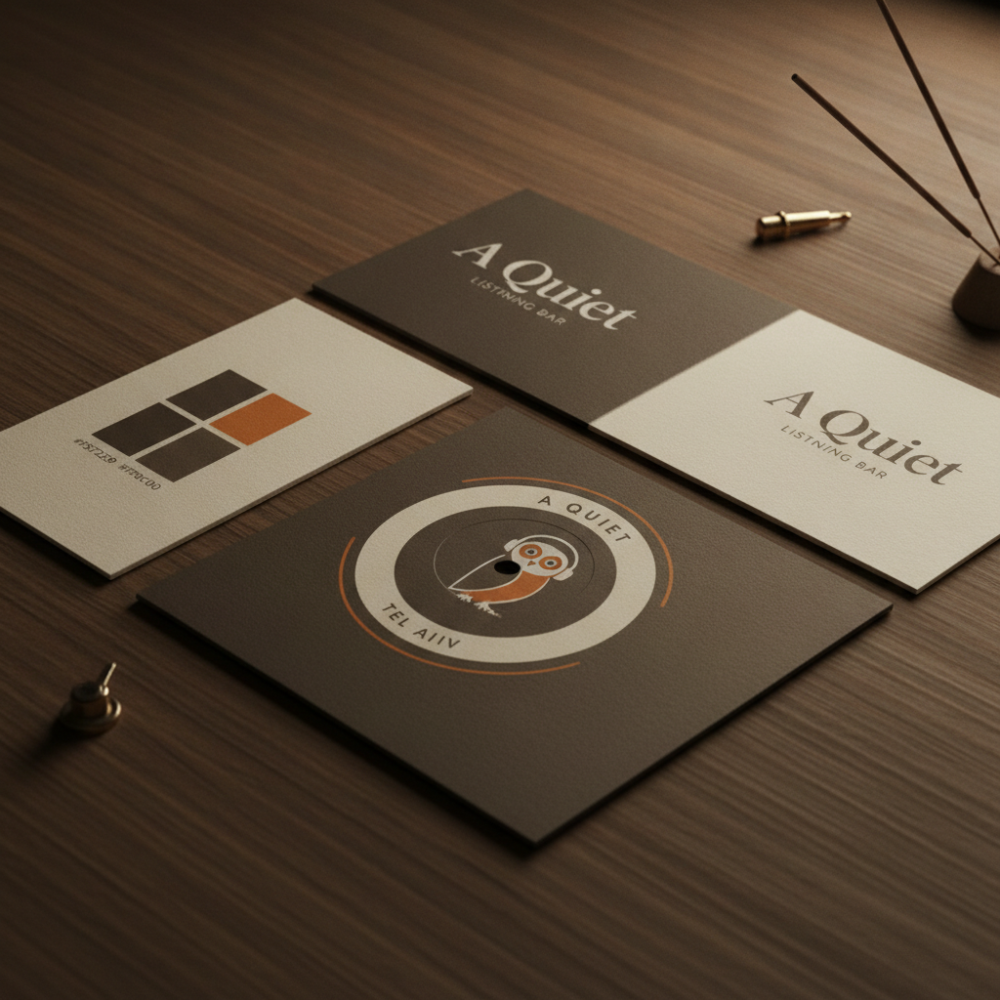

# A Quiet — Brand Style Guide (2026)

This document establishes the official visual and verbal brand system for **A Quiet**, ensuring uncompromising consistency across the physical sanctuary on Mazeh Street, the digital member portal, and all external marketing materials.

---

## 1. Visual Brand Style Mockup

---

## 2. Color Palette (Glow Nocturne System)

The brand color system is designed around the tactile warmth of physical print and the nocturnal glow of vacuum tube amplification. 

| Palette Component | Hex Code | CMYK (Print-Ready) | Role & Application |
| :--- | :--- | :--- | :--- |
| **Aged Parchment** | `#F5F2E9` | C4 M3 Y9 K0 | Primary Background, digital workspace background, and paper stock reissues. |
| **Deep Walnut** | `#3C2F2F` | C62 M70 Y66 K68 | Primary Typography, custom millwork, structural cabinetry elements, and dark UI borders. |
| **Tube Glow Orange** | `#FF8C00` | C0 M55 Y100 K0 | Accent Highlights, buttons, active states, map pulses, and digital glowing elements. |
| **Nocturnal Black** | `#1A1A1A` | C75 M68 Y67 K90 | Underlays, standard typography background for dark-mode screens, and physical vinyl styling. |
| **Forest Velvet** | `#2D3E33` | C71 M44 Y65 K39 | Soft furnishings, custom curtain specifications, acoustic treatment fabric wrapping. |

---

## 3. Typography Hierarchy

Our typographic style mirrors mid-century jazz record sleeves (Blue Note, Prestige) combined with a clean, unhurried modern editorial layout.

### Primary Display Typeface: **Playfair Display** (Serif)
*   **Vibe**: Heritage, literary, intellectual, tactile.
*   **Usage**: Headlines, titles, sections headers, logos, and quote blocks.
*   **Weights**: Regular (400) for standard layout; Bold (700) for high-impact title placements.

### Secondary Body Typeface: **Source Sans 3** (Sans-Serif)
*   **Vibe**: Contemporary, clean, highly readable, precise.
*   **Usage**: Body text, tabular datasets, pricing tables, buttons, form fields, and metadata labels.
*   **Weights**: Light (300) for subtle blocks; Regular (400) for standard reading; Semi-Bold (600) for buttons and active states.

---

## 4. Brand Personality & Copywriting Rules

To preserve the sanctuary experience, all brand communication must remain "low-fi."

*   **Rule 1: Cultivate Stillness** — Avoid high-energy, hyper-promotional exclamation marks or aggressive sales copy. Speak with unhurried authority.
*   **Rule 2: Emphasize the Analog Ritual** — Focus on tactile, sensory details (the weight of the 180-gram pressing, the warmth of the vacuum tube glow, the smell of oiled American Walnut).
*   **Rule 3: Keep it Local & Respectful** — Position "A Quiet" as a respectful neighbor within the Lev HaIr resident association. Frame all operations as a cultural addition to the historical Bauhaus context.
